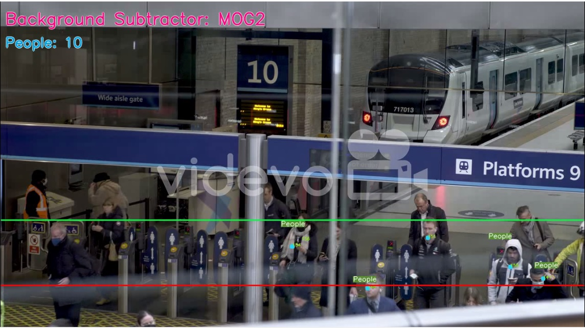

# Pedestrian Monitoring System
> Detect pedestrian and count via live video feed

## Table of Contents
- [Pedestrian Monitoring System](#pedestrian-monitoring-system)
  - [Table of Contents](#table-of-contents)
  - [General Information](#general-information)
  - [Technologies Used](#technologies-used)
  - [Features](#features)
  - [Screenshots](#screenshots)
  - [Setup](#setup)
  - [Usage](#usage)
  - [Project Status](#project-status)
  - [Contact](#contact)


## General Information
A project based on detecting and counting pedestrians. This system uses computer vision techniques like background substraction, motion detection and tracking to monitor, detect and count the number of people passing through a point in a video feed. This is beneficial in counting people who visited an area for instance or house or party.


## Technologies Used
- Python
- OpenCV


## Features
- Detect and count pedestrians


## Screenshots



## Setup
- It is required to have Python already installed.


## Usage
```
git clone
cd (directory of repo)
pip install -r requirements.txt
python main.py
```


## Project Status
Project is: _complete_ 


## Contact
Created by [@EmmanuelSamuel](samuelmayowaemmanuel@gmail.com) - feel free to contact me!
